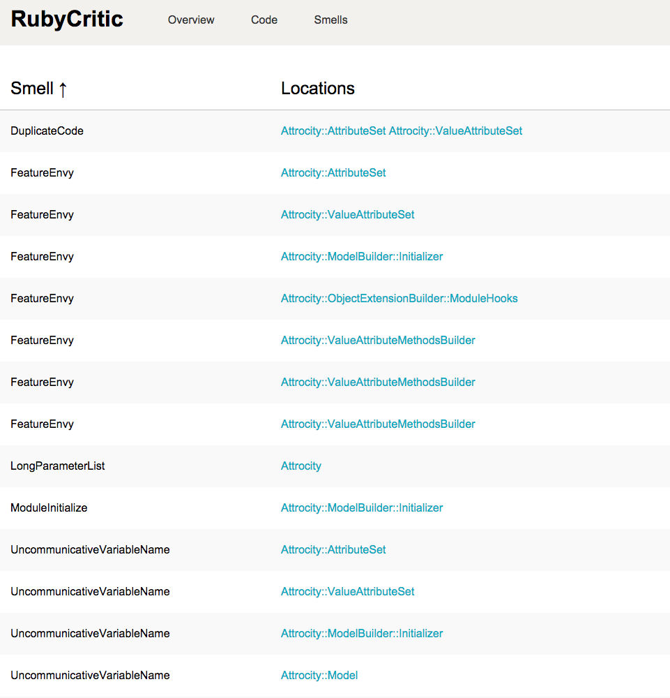
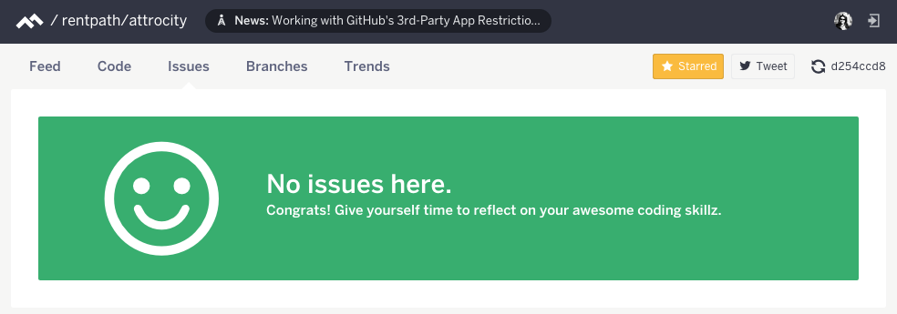

# Static Analysis Tools

---

## Intro

- Short talk, originally aimed at novice developers
- Tweaked slightly to emphasize tools

---

# Example code

---

## Pattern

- Write code
- Run analysis tool for feedback
- If necessary, research detected code smells
- Follow recipes in code smell literature
- Re-run code analysis tool
- Profit!

---

# Tools

---

# rubycritic

- Open source
- Command line
- Generates local reports

---

# Code Climate

- Static analysis as a service
- Github integration (requires push to github remote)
- Supports several languages: Ruby, JavaScript, PHP
- Free for public repositories
- Paid plans for private repositories

---

# Similarities

- Wrappers around open source analysis tools: reek, flog, flay
- Chart churn, quality/complexity
- Provide scores
- Detect code smell issues
- Far from perfect

---



---



---

```ruby
module Attrocity
  class Attribute

    attr_reader :name, :coercer, :mapper, :default

    def initialize(name, coercer, mapping, default=nil)
      @name = name
      @coercer = coercer
      @default = default
      @mapper = init_mapper(mapping)
    end

    def self.default_mapper(key, default_value)
      KeyMapper.new(key, default_value)
    end

    def to_value_attribute(data)
      val = ValueExtractor.new(data, mapper: mapper, coercer: coercer).value
      ValueAttribute.new(name, val)
    end

    private

    def init_mapper(mapping)
      if mapping.respond_to?(:call)
        mapping
      else
        self.class.default_mapper(mapping, default)
      end
    end
  end
end
```

---


---

# Thanks

